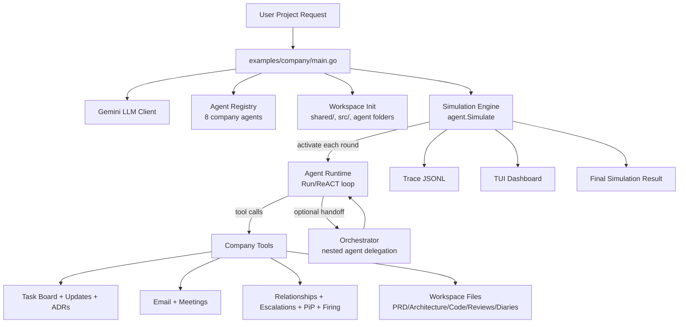

# Agents - Company Simulation

This project is a Go-based multi-agent simulation of a software company.  
Eight role-based agents (CEO, PM, CTO, Architect, Project Manager, Backend, Frontend, DevOps) collaborate in rounds to turn a product request into requirements, architecture, tasks, code, reviews, and operational decisions.

The simulation is stateful and file-backed: agents act through tools (tasking, docs, email, meetings, escalations, reviews), while shared state and workspace artifacts track the company over time.

## Run

```bash
GEMINI_API_KEY=your_key go run ./examples/company "Build a simple todo REST API with CRUD operations"
```

Generated outputs are written under `workspace/` (for example: `shared/prd.md`, `shared/architecture.md`, `shared/task_board.md`, `shared/updates.md`, `src/`, agent diaries/inboxes, and `trace.jsonl`).

## Architecture (Company Simulation)


