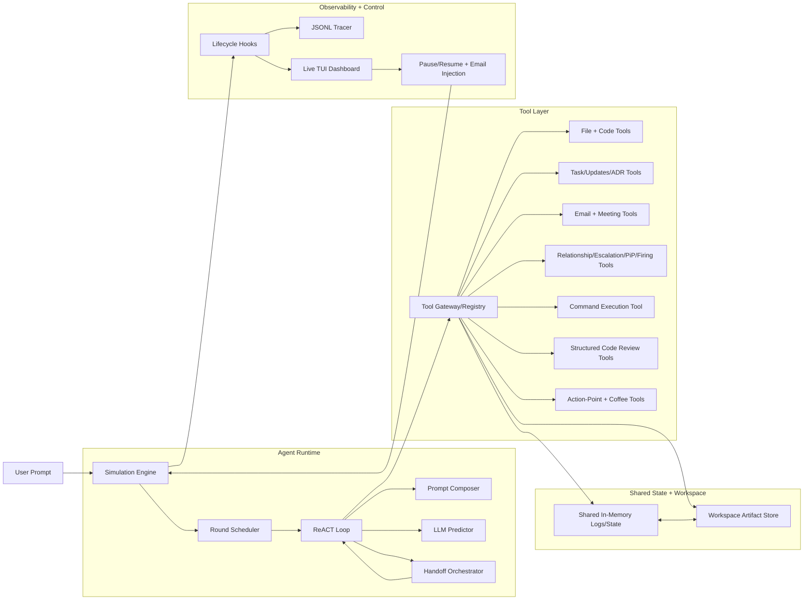

# Agents - Company Simulation

This project is a Go-based multi-agent company simulator.  
Eight role-based agents (CEO, Product Manager, CTO, Architect, Project Manager, Backend, Frontend, DevOps) collaborate in rounds to turn a product request into requirements, architecture, tasks, code, reviews, and operational decisions.

The simulation is stateful and file-backed: tools mutate shared in-memory state and sync durable artifacts into a `workspace/` directory.

## Run

```bash
GEMINI_API_KEY=your_key go run ./examples/company "Build a simple todo REST API with CRUD operations"
```

The run starts an interactive TUI dashboard.  
Artifacts are written under `workspace/` (for example: `shared/prd.md`, `shared/architecture.md`, `shared/tasks.json`, `shared/updates.md`, `shared/decisions.md`, `shared/code-reviews/`, `shared/meetings/`, `shared/coffee/`, `shared/escalations.md`, `shared/pips.md`, `shared/firings.md`, `shared/command-log.md`, `src/`, per-agent `diary.md`/`inbox.md`/`personality.md`, and `trace.jsonl`).

## Simulation Capabilities

- Round-based simulation with CEO bootstrap (round 0), configurable max rounds, and early stop on `project_status=complete` or all-agents-idle.
- ReACT agent runtime with tool calling, lifecycle hooks, token/iteration accounting, and optional nested handoffs between agents.
- Role and behavior modeling via prompt mixins, org hierarchy, and randomized personalities (hard-working/slacker/malicious).
- Persistent workspace collaboration: PRD, architecture docs, ADRs, task board, status updates, diaries, and source files.
- Task execution workflow with assignees, priorities, dependencies, optional deadline (target simulation round), reviewer assignment, and status transitions (persisted as structured JSON in `shared/tasks.json`).
- Coding toolchain with file read/write/edit/search/diff plus a guarded `run_command` tool (allow-list, timeout, capped output, safe env).
- Structured code reviews (`start_code_review`, inline comments, verdict submission, review history with source context).
- Communication systems: async email threads, urgent emails (out-of-turn activation), and 2-round multi-agent group meetings.
- Social/governance dynamics: relationship scores, formal escalations, manager responses, PiP records, and CEO-approved firing workflow.
- Energy/AP economy per round with per-tool costs, hard cap enforcement, optional coffee breaks, and between-round coffee chat.
- Observability and control: live TUI telemetry, pause/resume, manual email injection, and JSONL event tracing.

## Architecture (Code)


